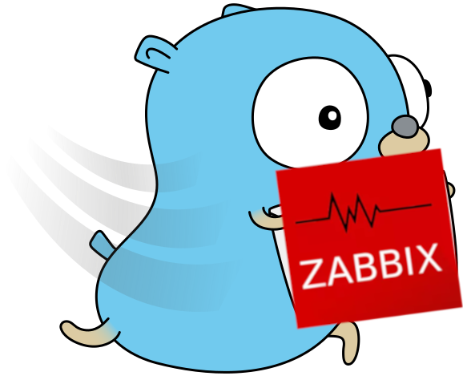

<p align="center">
   
</p>

# Gotify Notifications for Zabbix

This GitHub repository contains a script for integrating [Gotify](https://gotify.net/docs/install) to be able send notifications with Zabbix. Follow these instructions to set up and use the script with your Zabbix and Gotify instances.


## Prerequisites

- Zabbix Server (version 5.0 or later recommended)
- Access to the Zabbix server with admin privileges
- A ready-to-use Gotify instance

## Installation and Configuration

### Step 1: Create an API Token in Gotify

Before setting up the script, you will need to create an application in Gotify to generate an API token.

1. **Log into your Gotify server**:
   - Login to the Gotify UI via your web browser.

2. **Create a new application**:
   - Navigate to the `Apps` section;
   - Press on `Create App`;
   - Enter the name for your application, for example `Zabbix Notifications`;
   - Press `Create`.

3. **Copy the API Token**:
   - Once the application is created, you'll see an API Token.
   - Copy this token as it will be used in the `gotify.sh` script.

### Step 2: Customize and Deploy the Script

1. Clone the repository or download `gotify.sh` from this repository.

2. Edit `gotify.sh` to set up your Gotify server details:
   
   - Replace `http://change.me` with your Gotify server URL. For example, `http://10.94.1.198` or `https://gotify.example.com`.

3. Copy the script to the Zabbix alertscripts directory, typically located at `/usr/lib/zabbix/alertscripts/`.

   ```bash
   sudo cp gotify.sh /usr/lib/zabbix/alertscripts/
   ```

4. Make the script executable:

   ```bash
   sudo chmod +x /usr/lib/zabbix/alertscripts/gotify.sh
   ```

### Step 3: Configure Zabbix Media Type

1. Log into your Zabbix frontend.

2. Navigate to `Administration > Media Types` and click `Create Media Type`.

3. Select `Script` as the type and add a name, like `Gotify`.

4. For the script name, enter `gotify.sh`.

5. Define the following parameters:
   - `{ALERT.SENDTO}` - Gotify API Token
   - `{ALERT.SUBJECT}` - Notification subject
   - `{ALERT.MESSAGE}` - Notification message
   - `{TRIGGER.SEVERITY}` - Trigger severity (used to determine priority in Gotify)

6. Configure Message Templates:
   - Navigate to the `Message templates` tab.
   - Create templates for the different conditions under which notifications should be sent. Each template should specify the message format for the subject and body.

7. Save the new Media Type.

### Step 4: Add Media to a Zabbix User

1. In Zabbix frontend, go to `Administration > Users`.

2. Edit the user who should receive Gotify notifications.

3. Under the `Media` tab, add the Gotify media type.

4. In the `Send to` field, enter your Gotify API Token.

5. Save the changes.

### Step 5: Testing

Create a test trigger or wait for an actual alert to verify that notifications are being sent correctly to Gotify.

## Note

- Ensure, that you have replaced `http://change.me` in the `gotify.sh` script with your actual Gotify server URL.
- The mapping between Zabbix severity levels and Gotify priorities can be adjusted within the script as per your requirements.
